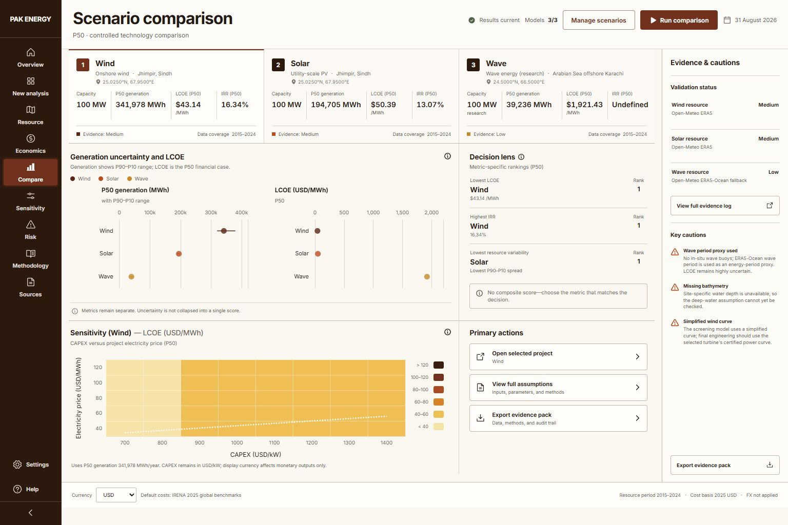
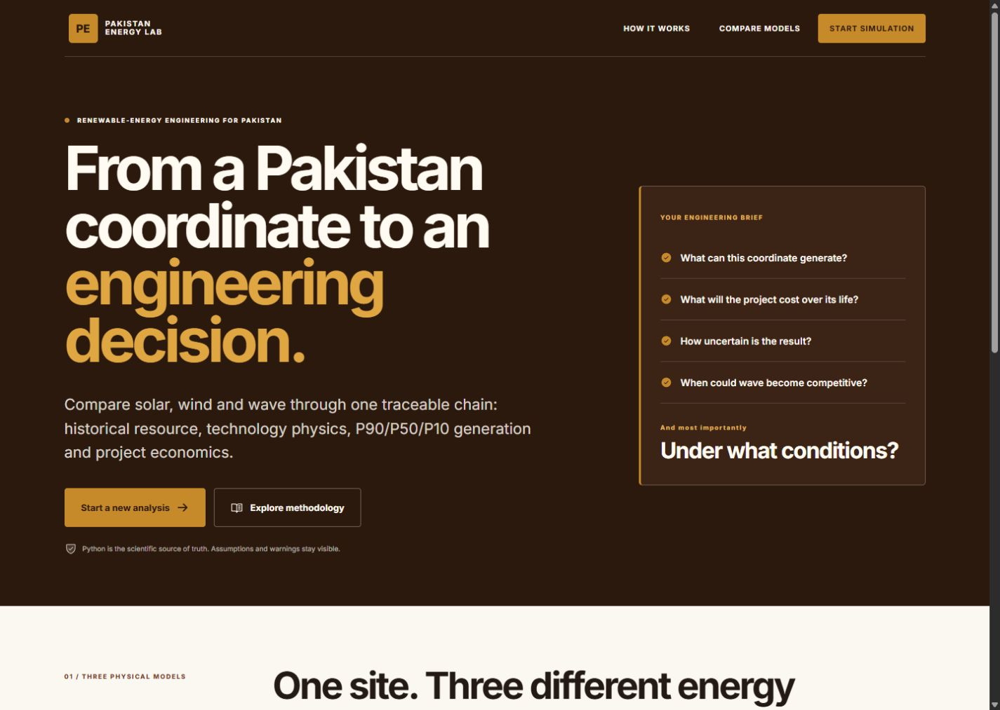
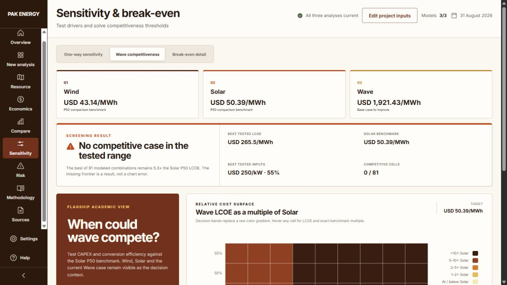

# Pakistan Energy Simulator — Solar, Wind & Wave Techno-Economic Analysis

[](https://github.com/mbax0009/Pakistan-Energy-Simulator/actions/workflows/ci.yml)
[](https://github.com/mbax0009/Pakistan-Energy-Simulator/releases/latest)
[](https://www.python.org/)
[](https://github.com/mbax0009/Pakistan-Energy-Simulator/releases/latest)

Pakistan Energy Simulator is a local-first renewable-energy modelling and
techno-economic analysis platform for utility-scale solar PV, onshore wind and
research-grade wave-energy projects in Pakistan. Enter coordinates directly, run a
traceable physical model, and carry P90/P50/P10 resource evidence into LCOE, NPV, IRR,
payback, comparison, sensitivity, break-even, standalone Monte Carlo risk and paired
joint uncertainty across all three technologies.

**[Download for Windows](https://github.com/mbax0009/Pakistan-Energy-Simulator/releases/latest)** ·
[Review methodology](docs/METHODOLOGY.md) ·
[Inspect validation](docs/VALIDATION.md) ·
[View data sources](docs/DATA_SOURCES.md)



The simulator is decision support, not a bankability study. It deliberately keeps
source metadata, assumptions, uncertainty, and warnings visible and never collapses
unlike technologies into a fabricated overall score.

## Download for Windows

- [**Portable ZIP**](https://github.com/mbax0009/Pakistan-Energy-Simulator/releases/download/v1.1.1/Pakistan-Energy-Simulator-v1.1.1-win-x64.zip) — fastest repeated startup after extracting once.
- [**One-click EXE**](https://github.com/mbax0009/Pakistan-Energy-Simulator/releases/download/v1.1.1/Pakistan-Energy-Simulator-v1.1.1-win-x64.exe) — simplest single-file option; the first launch is slightly slower while Windows unpacks its bundled runtime.
- [**SHA-256 checksums**](https://github.com/mbax0009/Pakistan-Energy-Simulator/releases/download/v1.1.1/SHA256SUMS.txt)

Both packages run on Windows 10/11 x64 without a separate Python or Node installation.
The latest verified packages and SHA-256 checksums are published on the
[GitHub releases page](https://github.com/mbax0009/Pakistan-Energy-Simulator/releases/latest).

## Product experience



- Editorial home page and a guided New Analysis workflow.
- Direct latitude/longitude input for any site inside the Pakistan analysis bounds
  (23.5–37.1° N, 60.8–77.9° E); city selection is not required.
- Separate Resource, Economics, Compare, Sensitivity, Risk, Methodology, and Sources
  workspaces with functional tabs and real model outputs.
- Solar, Wind, and Wave project names remain distinct from editable site names.
- Historical annual-generation evidence with empirical P90/P50/P10 statistics.
- CAPEX × conversion-efficiency Wave screening with a visible conclusion, best-tested
  case, Solar benchmark gap, decision-banded heatmap, and explicit break-even detail.
- Evidence-pack export, dated current-cost context, and transparent USD/PKR display
  conversion.
- Premium tobacco, walnut, ochre, and warm off-white interface designed as an
  engineering laboratory rather than a generic green dashboard.



The Wave view does not imply that an empty frontier is a failed chart. It reports when
no tested case reaches the benchmark, identifies the lowest modeled LCOE and its input
combination, and explains whether a CAPEX-only threshold exists inside the search range.

## Scientific and economic scope

- Hourly solar and wind retrieval from Open-Meteo historical/ERA5-derived data.
- Copernicus Marine wave support when credentials are supplied, with a documented
  Open-Meteo marine fallback.
- Explicit solar temperature/loss/degradation, wind hub height with a default tabulated
  NLR/IEA 3.4 MW power curve (cubic fallback only), and a deep-water
  wave-flux/capture-width model chain.
- NPV, unlevered project IRR, LCOE, simple payback, and discounted payback.
- One-way and two-way sensitivity, break-even root finding, reproducible standalone
  Monte Carlo analysis, and same-world paired probabilities for NPV and LCOE.
- Typed FastAPI requests and responses, local JSON caching, and automatic OpenAPI
  documentation.

Default solar and wind CAPEX inputs use IRENA's 2025 global benchmarks in 2025 USD and
remain editable project assumptions. Electricity sale price is also editable; the UI
does not present one universal Pakistan tariff. USD/PKR is a dated display conversion
from an identified live feed with a dated bundled fallback and an SBP reference link.

## Windows x64 standalone

The release artifacts are available from the
[v1.1.1 release](https://github.com/mbax0009/Pakistan-Energy-Simulator/releases/tag/v1.1.1):

- [Portable Windows ZIP](https://github.com/mbax0009/Pakistan-Energy-Simulator/releases/download/v1.1.1/Pakistan-Energy-Simulator-v1.1.1-win-x64.zip)
- [One-click Windows EXE](https://github.com/mbax0009/Pakistan-Energy-Simulator/releases/download/v1.1.1/Pakistan-Energy-Simulator-v1.1.1-win-x64.exe)
- [SHA-256 checksums](https://github.com/mbax0009/Pakistan-Energy-Simulator/releases/download/v1.1.1/SHA256SUMS.txt)

Both bundle the application, Python runtime, local API, scientific models, reference
data, and compiled frontend. The portable ZIP starts fastest after extraction; the
single EXE is the easiest one-click option and unpacks its runtime on launch. Neither
requires Python, Node, npm, pip, or a compiler. A first analysis for a new coordinate
requires internet access to retrieve its historical resource record; repeat requests
use the local cache beside the executable.

Build a Windows release locally:

```powershell
Set-Location .\Pakistan-Energy-Simulator
.\scripts\build_windows_release.ps1
```

The script runs tests and linting, builds the frontend, creates the portable ZIP and
one-click EXE, writes release-level hashes to `release\SHA256SUMS.txt`, and creates an
internal `FILE-MANIFEST.sha256` for every extracted package file. Use the former to
verify a downloaded ZIP/EXE and the latter after extraction. Every build cache and
temporary file stays under D:. See [the release guide](docs/WINDOWS_RELEASE.md).

## Development setup on Windows

```powershell
git clone https://github.com/mbax0009/Pakistan-Energy-Simulator.git
Set-Location .\Pakistan-Energy-Simulator
py -3.13 -m venv .venv
.\.venv\Scripts\python.exe -m pip install --upgrade pip
.\.venv\Scripts\python.exe -m pip install -e ".[dev,wave,package]"
Set-Location frontend
npm ci
npm run build
Set-Location ..
.\.venv\Scripts\python.exe -m simulator_api.launcher
```

The launcher binds to `127.0.0.1:8765`, stores cache and temporary files in the local
project/runtime folder, and opens the application in the default browser.

Run verification:

```powershell
.\.venv\Scripts\python.exe -m pytest
.\.venv\Scripts\python.exe -m ruff check .
Set-Location frontend
npm run build
npm run test:sites
```

## Repository map

```text
analysis/       Sensitivity, comparison, risk, and project evaluation
core/           Validated domain models, lifecycle logic, and units
data/           Providers, cache, assumptions, market context, reference data
finance/        Cash-flow and financial metrics
physics/        Solar, wind, and wave production models
simulator_api/  FastAPI contract, service layer, and desktop launcher
frontend/       React product interface and charts
packaging/      PyInstaller specification and release payload
scripts/        Validation cases and Windows release automation
tests/          Unit and integration tests
docs/           Methods, sources, assumptions, limits, validation, release notes
```

## Documentation

- [Methodology](docs/METHODOLOGY.md)
- [Data sources](docs/DATA_SOURCES.md)
- [Assumptions](docs/ASSUMPTIONS.md)
- [Validation](docs/VALIDATION.md)
- [Limitations](docs/LIMITATIONS.md)
- [Development](docs/DEVELOPMENT.md)
- [Windows release](docs/WINDOWS_RELEASE.md)
- [Security policy](SECURITY.md)
- [How to cite the simulator](CITATION.cff)

## Related work

- [GreenInvest Pakistan](https://github.com/mbax0009/GreenInvest-Pakistan) — explainable solar, battery and inverter decisions for residential, commercial and industrial users.
- [Muhammad Bin Asad's portfolio](https://mbax0009.github.io/) — project context, product background and selected engineering work.

## License

Pakistan Energy Simulator is released under the [BSD 3-Clause License](LICENSE).
Third-party material retains its own terms; see
[THIRD_PARTY_NOTICES.md](THIRD_PARTY_NOTICES.md) and the vendored wind-reference
[notice](data/reference/turbines/NOTICE.md).
